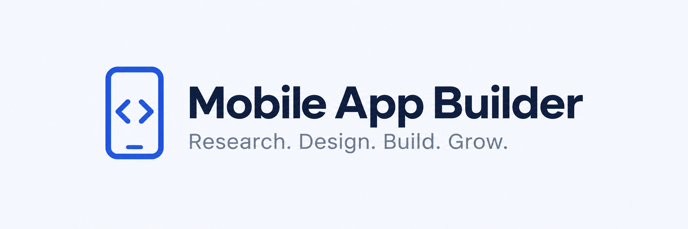

# Mobile App Builder Agency



The full Mobile App Builder agency, rebuilt for Anthropic's native plugin format. **189 workflows, 16 specialist agents and eight departments** cover mobile research, product strategy, UI/UX and design inspiration, iOS/Android engineering, QA, store assets and metadata, launch, advertising, influencer intelligence and SEO.

Start with an idea or bring an existing app. Keep the established product direction and choose only the relevant department for a focused task. See the [agency guide](plugins/mobile-app-builder-agency/README.md), [complete department index](plugins/mobile-app-builder-agency/agency/INDEX.md) and [resources](plugins/mobile-app-builder-agency/docs/RESOURCES.md).

## Install the agency

```text
/plugin marketplace add khadinakbarlabs/mobile-app-builder-agency
/plugin install mobile-app-builder-agency@khadin-mobile-agency
```

For live Apify collection, independently install the optional research connection:

```text
/plugin install mobile-app-builder-research@khadin-mobile-agency
/plugin configure mobile-app-builder-research@khadin-mobile-agency
```

Configure the token through the host's secure plugin configuration. Do not paste it into chat, a shell command or a public repository. Read the [research connection guide](plugins/mobile-app-builder-research/README.md) before running any Actor. The agency can plan research and analyze exports without that connection.

## What changed

The complete previous native plugin is accounted for in the [migration report](migration/report.json). Workflow IDs, agents, templates, Actor catalog and original logo/banner carry over from v1.3.9. Host metadata and research authentication are adapted for this edition. Publisher tools, tests and migration records live outside the installed plugin folders. There is no OpenAI/Cursor overlay or hosted app backend in this repository.

The [architecture](docs/ARCHITECTURE.md) explains the boundaries. [Owner review](docs/OWNER-REVIEW.md) lists verification and remaining gates. [Publisher guide](docs/PUBLISHING.md) covers tests, inventory and release packaging. Each plugin is independently installable and independently reviewed.

## Verification and status

This edition is prepared for owner review. GitHub publication is separate from Anthropic directory submission, security scanning and reviewer approval. The previous Mobile App Builder v1.3.9 remains in its original review and is not replaced or withdrawn. Creating this repository does not clear that hold or guarantee approval.

The optional research configuration is structurally validated. Live authenticated Actor execution still needs an owner-selected account and approved run budget. The original iOS/Android workflows are development guidance; manifest validation is not device QA.

[License](LICENSE) · [Core privacy](plugins/mobile-app-builder-agency/PRIVACY.md) · [Research privacy](plugins/mobile-app-builder-research/PRIVACY.md) · [Support](https://github.com/khadinakbarlabs/mobile-app-builder-agency/issues)
