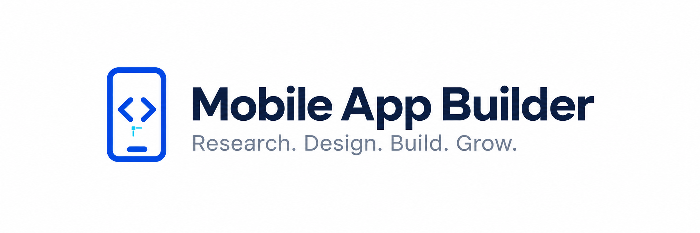

# Mobile App Builder



Research, design, build and grow **iOS, Android and web apps**. Mobile App Builder offers **30 focused skills, 8 specialist leads and 8 commands** for product research, UI/UX, development, QA, screenshots, store metadata, launch, marketing and SEO. All 190 detailed workflows remain available as references.

## Start where you are

- **New app:** “Research this idea, identify the first useful feature, and plan the iOS, Android and web experience.”
- **Existing app:** “Inspect my app, preserve its design, fix this problem, and verify the affected behavior.”
- **Focused task:** “Improve my onboarding,” “Prepare store screenshots,” or “Fix my website SEO.”

The assistant selects the relevant workflows and specialists. You can begin with research, design, engineering, testing, launch or growth. Use `/mobile-app-builder:new-app` or `/mobile-app-builder:improve-app` for the two common starting points. See [getting started](plugins/mobile-app-builder/docs/START-HERE.md), [workflow index](plugins/mobile-app-builder/agency/INDEX.md) and [resources](plugins/mobile-app-builder/docs/RESOURCES.md).

## What is included

| Area | Outcomes |
| --- | --- |
| Research | Demand, competitors, store intelligence, creators, ads and search |
| Strategy | Product brief, positioning, pricing and a focused first feature |
| Design | UI/UX, inspiration, accessible journeys and visual handoff |
| Development | Shared features, native capabilities and responsive web experiences |
| QA | Behavioral checks, accessibility, performance, privacy and security |
| Launch | Screenshots, metadata, localization and release readiness |
| Growth | Advertising, influencer research, retention and SEO |
| Coordination | Scope, specialist ownership, handoffs and evidence |

## Install

```text
/plugin marketplace add khadinakbarlabs/mobile-app-builder
/plugin install mobile-app-builder@khadin-mobile-builder
```

Describe your outcome in ordinary language. Platform-specific tooling runs in your development environment. Research-service credentials and optional integrations belong in technical setup, not product prompts; do not paste secrets into chat or public files. You can start with public sources or your own research exports.

Research and release workflows can send authorized data through backend tools. See [technical CLI data handling](plugins/mobile-app-builder/docs/CLI-DATA-HANDLING.md) for the destinations, local storage and credential boundaries.
The [owner-operated research CLI reference](docs/BACKEND-RESEARCH-CLI.md) remains available in this repository but is excluded from the installed core package.

## Verification

All 189 previous workflows and 16 specialist role cards remain readable behind the consolidated entry points, with supporting references, templates and artwork retained. The added web workflow covers responsive UI, routing, rendering, accessibility, SEO and browser verification. The [migration report](migration/report.json) accounts for every previous native file.

Release checks cover package integrity, credential safety, native manifests and actual component discovery. They do not prove a consuming app's deployment, device behavior or store approval. Directory submission and its reviewer status are reported separately.

[License](LICENSE) · [Privacy](plugins/mobile-app-builder/PRIVACY.md) · [Terms](plugins/mobile-app-builder/TERMS.md) · [Support](https://github.com/khadinakbarlabs/mobile-app-builder/issues)
